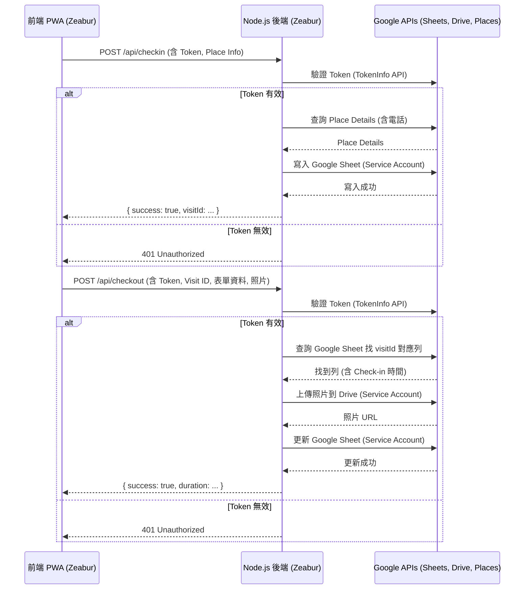

# 從點子到應用：打造業務陌生開發 Check-in 工具的踩坑與實踐 (Node.js + Google API + Zeabur)


*(建議：放一張應用程式截圖或流程圖)*

身為一個希望透過科技解決實際問題的人，我最近為業務團隊開發了一個小工具，旨在解決他們進行陌生開發拜訪時，記錄資訊效率低落的問題。這個過程充滿了學習、除錯，以及架構上的轉變，我想在這裡分享整個迭代的旅程。

**專案目標：告別手寫，提升效率**

業務同仁常常需要拜訪大量陌生店家（尤其是餐廳），傳統上用紙筆或手機備忘錄記錄地點、時間、接觸對象、結果等資訊，不僅耗時、格式不一，後續也很難彙整分析。我的目標是建立一個簡單、直覺的行動網頁應用程式 (PWA)，讓他們能快速完成 Check-in/Check-out，並將資料自動化記錄。

**最終成品亮點：**

*   **地圖點選 Check-in**：透過手機定位，直接在地圖上點選拜訪店家。
*   **兩階段紀錄**：區分進店 (Check-in) 與出店 (Check-out) 時間，自動計算拜訪時長。
*   **拍照上傳**：Check-out 時可直接拍照上傳至 Google Drive。
*   **條件式表單**：根據「是否再訪」決定是否需填寫聯絡人資訊。
*   **自動化記錄**：所有資料（包含業務 Email、照片連結）自動存入 Google Sheets。
*   **公司帳號登入**：使用 Google OAuth 限制特定網域 (@ichef.com.tw) 登入。

**線上 Demo:** [https://coldvisit-checkin.zeabur.app](https://coldvisit-checkin.zeabur.app) (需要 `@ichef.com.tw` Google 帳號登入)
**GitHub Repo:** [https://github.com/keweikao/coldvisit_checkin_tool](https://github.com/keweikao/coldvisit_checkin_tool)

---

## 迭代旅程：從 App Script 的 CORS 惡夢到 Node.js

這個專案並非一帆風順，尤其在後端技術的選擇上經歷了重大的轉折。

### 迭代 1：Google App Script - 看似美好的起點

考量到需求主要是與 Google Sheets 和 Drive 互動，最初我選擇了 Google App Script (GAS) 作為後端。GAS 與 Google 生態系完美整合，部署為 Web App 似乎能快速實現 API 功能。

**架構：** 前端 PWA (純 HTML/JS) → GAS Web App → Google Sheets/Drive

**遇到的問題：頑固的 CORS 錯誤**

本地測試一切順利，但將前端部署到 Zeabur 後，災難降臨了。瀏覽器不斷報錯：

```
Access to fetch at 'https://script.google.com/...' from origin '...' has been blocked by CORS policy: Response to preflight request doesn't pass access control check: No 'Access-Control-Allow-Origin' header is present...
```

這是典型的跨來源資源共用 (CORS) 問題。瀏覽器在發送帶有自訂標頭 (如 `Authorization`, `Content-Type: application/json`) 的 POST 請求前，會先發送一個 `OPTIONS` 預檢請求。問題在於，我的 GAS Web App (即使設定為「任何人」可存取、「執行身份：我」) 無法正確回應這個預檢請求，導致瀏覽器阻止了真正的 API 呼叫。

**嘗試的解法 (均失敗)：**

1.  **加入 `doOptions(e)` 函數**：根據官方文件和社群建議，加入 `doOptions` 函數並回傳 `ContentService.createTextOutput()`，理論上應能處理預檢請求。→ **失敗，錯誤依舊。**
2.  **在 `doPost` 回應中加入 CORS 標頭**：嘗試在 `doPost` 的 `jsonResponse` 中強制加入 `Access-Control-Allow-Origin` 標頭。→ **失敗，因為 `TextOutput` 物件不支援 `setHeader`，且預檢請求在 `doPost` 執行前就失敗了。**
3.  **修改部署設定 - 執行身份**：將「執行身份」從「我」改為「存取網路應用程式的使用者」。→ **失敗，同樣的 CORS 錯誤。** (雖然這改變了授權模式，但沒解決預檢問題)
4.  **修改部署設定 - 存取權限**：確認存取權限是「任何人」。→ **確認無誤，但錯誤依舊。**
5.  **建立獨立 App Script**：懷疑是 Workspace 網域綁定 (`/a/macros/...`) 造成影響，建立了一個獨立腳本 (`/macros/s/...`)，複製相同程式碼並部署。→ **失敗，同樣的 CORS 錯誤！**
6.  **簡化前端請求**：移除前端 `fetch` 中的 `Authorization` 和 `Content-Type` 標頭，嘗試發送最簡單的 POST 請求。→ **失敗，預檢請求仍然失敗。**

`[在此插入瀏覽器 CORS 錯誤截圖]`

**學習點：** Google App Script Web App 在處理來自外部網域、需要預檢的 CORS 請求時，行為可能不如預期，特別是當部署設定或網域環境較複雜時。除錯資訊有限，過程非常挫折。

### 迭代 2：轉向 Node.js - 繞過 CORS

在 App Script 卡關後，決定轉換思路：既然無法讓瀏覽器直接呼叫 App Script，那就**增加一個中間層**。

**新架構：** 前端 PWA → **Node.js 後端 (on Zeabur)** → GAS Web App → Google Sheets/Drive

這個 Node.js 後端部署在 Zeabur 上，與前端同源或更容易配置 CORS。它的唯一工作就是接收前端請求，然後從**伺服器端**去呼叫 App Script URL。伺服器之間的呼叫沒有瀏覽器 CORS 限制。

### 迭代 3：Node.js 直連 Google API - 最終方案

建立了 Node.js 代理後，我意識到：既然都有 Node.js 後端了，何必再透過 App Script？Node.js 完全可以使用官方的 `googleapis` 函式庫，搭配**服務帳戶 (Service Account)** 金鑰，直接、穩定地操作 Google Sheets 和 Drive API，甚至自己呼叫 Places API。

**最終架構：** 前端 PWA → **Node.js 後端 (on Zeabur)** → Google Sheets/Drive/Places API

`[在此插入最終架構圖，可用 Mermaid]`



這個架構雖然需要在 Google Cloud Console 設定服務帳戶、啟用 API、設定權限，並在 Zeabur 上管理環境變數 (存放服務帳戶金鑰 JSON)，但它徹底解決了 CORS 問題，並且是更標準、更健壯的後端開發模式。

---

## 前端演進：從列表到地圖

最初的設計是後端搜尋附近地點，前端顯示列表讓業務選擇。但在測試中發現 `nearbySearch` API 的結果有時不如預期，可能找不到地圖上明明存在的店家。

為了提升準確性和使用者體驗，前端改為使用 **Google Maps JavaScript API**：
1.  直接在前端載入互動式地圖，中心點為使用者 GPS 位置。
2.  使用前端 `PlacesService.nearbySearch` 搜尋附近地點 (僅依半徑，不限類型)。
3.  將結果顯示為地圖上的**標記 (Marker)**。
4.  點擊標記跳出**資訊窗 (InfoWindow)**，顯示店家名稱、地址，並提供「選擇此店家 (Check-in)」按鈕。
5.  點擊按鈕後，才將選定的店家資訊 (Place ID, Name, Address) 送到後端進行 Check-in。

`[在此插入地圖選擇介面截圖]`

同時，Check-out 表單也根據需求增加了「接觸人員角色」下拉選單，並讓「聯絡人姓名/電話」欄位根據「是否再訪」的選擇動態顯示或隱藏。

`[在此插入 Check-out 表單截圖]`

---

## 部署挑戰：Zeabur 上的 `ERR_MODULE_NOT_FOUND`

在 Node.js 後端開發完成並部署到 Zeabur 後，又遇到了新的問題：執行階段錯誤 `Error [ERR_MODULE_NOT_FOUND]: Cannot find package 'googleapis'`。

奇怪的是，Zeabur 的**部署日誌 (Deployment Logs)** 明明顯示 `npm install` 成功執行，安裝了所有依賴項。但**執行階段日誌 (Runtime Logs)** 卻找不到 `googleapis`。

**嘗試的除錯步驟：**

1.  **確認 Node.js 版本**：原先使用 v22，嘗試在 `package.json` 中加入 `engines` 欄位指定使用 LTS 版本 v20。→ **問題依舊。**
2.  **加入偵錯 Log**：在 `server.js` 中嘗試解析模組路徑或列出 `node_modules`。→ **失敗，錯誤在 import 時就發生。**
3.  **簡化測試**：暫時移除 `server.js` 中所有 `googleapis` 相關程式碼，只保留 Express 基礎伺服器。→ **部署成功，伺服器正常啟動！** 這確認了問題與 `googleapis` 載入有關。
4.  **恢復 `googleapis`**：將完整程式碼加回去。→ **部署成功，錯誤消失了！**

**結論：** 雖然最終原因不明，但推測可能是 Zeabur 首次部署或建置快取時發生了暫時性問題，透過部署一個不含問題套件的簡化版本，再部署回完整版本，似乎解決了這個模組找不到的狀況。

---

## 最終成果與未來展望

經過一番波折，這個陌生開發拜訪紀錄工具總算是順利上線運作了！

`[在此嵌入展示操作流程的短影片或 GIF]`

雖然目前功能相對基礎，但已經能有效解決最初設定的痛點。未來還可以考慮增加：
*   更完整的地點資訊（透過 Place Details API 取得電話、營業時間等）。
*   離線儲存功能，應對網路不穩的狀況。
*   後台報表或數據分析儀表板。
*   更完善的使用者權限管理。

這次的開發經驗再次證明，軟體開發很少一蹴可幾，迭代、除錯、甚至轉換架構都是常態。重要的是從過程中學習，並找到最適合當下需求的解決方案。

希望這個分享對你有幫助！歡迎試用、查看程式碼，或留言交流你的想法！
